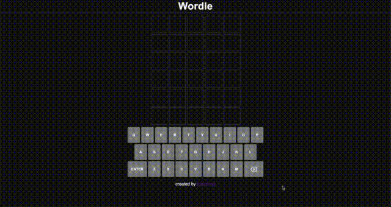

<h1 align="center">Howdy 🤠</h1>

  
  
  
<!--
  
  -->

<h1 align="center">Projects</h1>
<table bordercolor="#66b2b2">
  
  <tr>
    <td width="50%" valign="top">
      <h3 align="center">Jobioto</h3>
         
        
         
        

          
  
      

        
<strong>TypeScript, React, Python, & Flask</strong> - Web App where users enter a job post url and are generated an interactive display containing useful data points to help them quickly tailor their resume.

    </td>
    <td width="50%" valign="top">
      <h3 align="center">Wordle Cloned</h3>
         
      
         
        

          
  
  
      

        
<strong>TypeScript, React & Redux</strong> - Wordle web app clone created with React and Redux. New word every day. Try it it out!

    </td>
  </tr>
</table>
<!--

-->

<h1 align="center">Technologies</h1>

    
    
    
    
    
    
    
    
    
    
    

<!--
## Write ups:
1. [Data Analytics Capstone Case Study](https://medium.com/data-marketing-philosophy/data-analytics-capstone-case-study-c3944c0c2be) 📝
2. [Use Python and NLP to Boost Your Resume](https://medium.com/data-marketing-philosophy/use-python-and-nlp-to-boost-your-resume-e4691a58bcc9) 👔

**hayitsdavid/hayitsdavid** is a ✨ _special_ ✨ repository because its `README.md` (this file) appears on your GitHub profile.

Here are some ideas to get you started:

- 🔭 I’m currently working on ...
- 🌱 I’m currently learning ...
- 👯 I’m looking to collaborate on ...
- 🤔 I’m looking for help with ...
- 💬 Ask me about ...
- 📫 How to reach me: ...
- 😄 Pronouns: ...
- ⚡ Fun fact: ...

# testREADME

https://github.com/anuraghazra/github-readme-stats
-->
